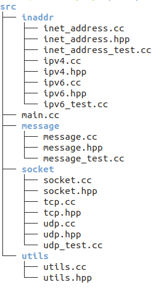

# CPP-Socket

The following information is dedicated to how to use this API (or a C socket wrapper you would say). To start, I'd like to introduce the API's skeleton:

As we can see above, I separated the API into 3 layers: IP, message and socket. In each layer, there are some sub classes that I'll explain it in detail later. Apart from the 3 main layers, there is also an extra package called "utils." That package is a helper for other packages. It helps in logging or giving error messages.

In each package, it doesn't contain only pure source codes. However, it also contains some unit testing codes. The way I organize the unit testing is very common in **"Go" (a modern programming language)** projects. I follow their style because I think it's very elegant and makes sense.

From now on, I'll be talking about how I designed, tested, and how to use the 3 main layers. I will walk you through step by step using a **top down approach**. I'll start with the IP layer. Then, I'll move to the socket layer. Lastly, I'll talk about the message layer.

## IP Layer

The IP layer is located in "inaddr". If we see what we have in the directory, we'd clearly see that we have 3 main things in the IP layer: inet_address (IP generic abstraction), ipv4, and ipv6.

* "inet_address" is an abstraction class that is designed to be very generic so that it can be extended to another protocol. It's also designed so that this class will be used to be an "interpolation" between a variety of protocols. 

* "ipv4" is the traditional IP version. This class is very specific to only support IPv4. "ipv4" supports the following:

  * Accept **dotted quad notations**
  * Accept **host names**
  * Accept **"*"**. This is a special character that means to accept incoming data to any network interface

* "ipv6" is the new version of IP, *also known as IPv6*. This class is very specific to only support IPv6. "ipv6" supports the following:

  * Accept **the 128-bit IPv6 address**
  * Accept **"*"**. This is a special character that means to accept incoming data to any network interface

  *Note: it doesn't support host names*

## Socket Layer

